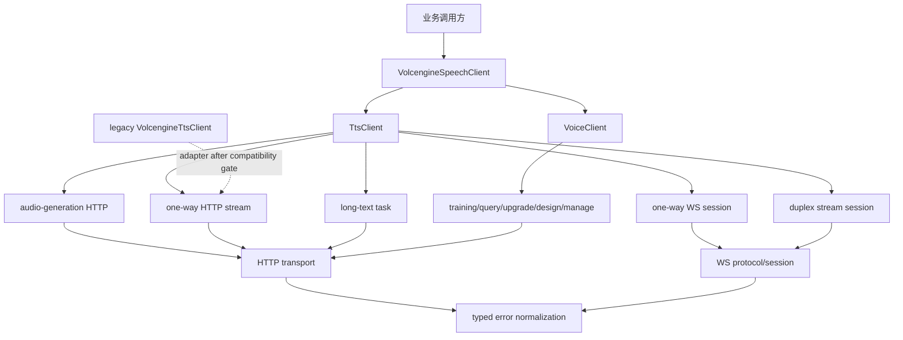

# Volcengine TTS 深度迭代方案

日期：2026-07-15
状态：执行中。循环 1 已完成官方文档取证和契约纠偏；后续循环以
[`volcengine-tts-contract-register.md`](./volcengine-tts-contract-register.md) 为准。
范围：`packages/shared-services/src/volcengine-speech`、旧
`packages/shared-services/src/volcengine-tts` 的兼容边界，以及对应的无密钥和
凭证门控验证。

## 1. 决策摘要

本轮不在旧 `volcengine-tts` client 上继续叠加接口。所有新 TTS 和音色能力进入
`volcengine-speech`，以两个明确的产品域承载：

- `client.tts`：音频生成、单向 HTTP 流、单向 WebSocket、双向流、异步长文本。
- `client.voice`：音色训练、查询、升级、设计和管理。

旧 `VolcengineTtsClient` 保留 public API、返回 DTO 和 TOS 上传语义；只有在逐项
兼容测试通过后，才委托它已经覆盖的“单向 HTTP 合成”路径到底层协议/transport。
新能力不得经由旧 client 暴露，也不得让统一 client 反向依赖旧模块。

这是一次契约收敛，而不是一次大迁移：每个产品接口都有独立的 endpoint、请求类型、
响应类型、错误映射与测试 fixture；不以 `action: string`、`body: Record<string,
unknown>` 和 `unknown` 响应作为正式 public API。

## 2. 现状与审查结论

### 已有可复用基础

- 统一 HTTP transport 已处理 `X-Api-Key`、`X-Api-Request-Id`、
  `X-Api-Resource-Id`、超时、有限重试、`X-Tt-Logid` 和 HTTP 错误归一化。
- `VolcengineWebSocketSession` / `VolcengineWebSocketCodec` 已具备连接生命周期、
  JSON/音频帧、gzip、sequence、错误帧和关闭状态保护。
- `task-result.ts` 可承载异步任务的共同追踪字段；旧 TTS 的 NDJSON、流归约、TOS
  上传和 legacy `TtsResultDto` 已有无密钥 smoke 保护。

### 本轮必须解决的缺口

1. 目前 `ttsStreaming` 只有泛化的 `synthesizeStream` 与
   `connectWebSocket(initPayload: unknown)`，没有区分单向 HTTP、单向 WS 和双向流的
   协议语义，也没有各自的 typed init/event/final-result 合约。
2. `voice.request(action, body)` 是不稳定的字符串拼接入口；其三个 convenience
   method 不能覆盖训练、查询、升级、设计和资源管理的请求/响应/任务生命周期。
3. `CreateAudioRequest` 与 `StreamingTtsRequest` 的参数范围来自早期实现，尚未以本次
   文档逐字段复核；不能继续把历史 endpoint 默认值当成当前协议事实。
4. `docs/0709/volcengine-speech/real-api-checklist.md` 的音频类文档编号与能力已错配：
   它将 `2534913` 标为音频生成、`2532486` 标为 HTTP 流式、`1829010` 标为 TTS WS，
   与本次确认的文档集合不一致。该清单不能作为本轮验收依据，必须先替换。
5. 错误码当前只做通用 HTTP/协议归一化。不同 TTS/音色接口的业务错误码尚未成为
   可判定的 typed 分类，调用方无法可靠区分参数错误、配额、音色状态和可重试故障。

## 3. 官方契约登记册

以下表格是本轮唯一的能力来源。循环 1 已通过官方 `getDocDetail` 内容接口完成 endpoint、
鉴权头、关键限制和流式事件的第一轮登记；逐字段的证据保存在
[`volcengine-tts-contract-register.md`](./volcengine-tts-contract-register.md)。未登记字段不得
由旧代码或记忆补全。

| 文档 ID | 官方能力 | 目标 public API | 调用形态 | 实施状态 |
| --- | --- | --- | --- | --- |
| [2550782](https://docs.volcengine.com/docs/6561/2550782?lang=zh) | 音频生成 HTTP | `client.tts.createAudio()` | HTTP JSON | endpoint 已核验，待 typed facade |
| [2528925](https://docs.volcengine.com/docs/6561/2528925?lang=zh) | 同步单向流式语音合成 HTTP | `client.tts.synthesizeHttpStream()` | HTTP response stream | endpoint 已核验，待 typed facade |
| [2534913](https://docs.volcengine.com/docs/6561/2534913?lang=zh) | 同步单向流式语音合成 WebSocket | `client.tts.connectOneWay()` | WebSocket | endpoint 已核验，待产品级 session |
| [2532486](https://docs.volcengine.com/docs/6561/2532486?lang=zh) | 同步双向流式语音合成 | `client.tts.connectDuplex()` | WebSocket | endpoint 已核验，待产品级 session |
| [1829010](https://docs.volcengine.com/docs/6561/1829010?lang=zh) | 异步长文本 | `client.tts.submitLongText()` / `queryLongText()` / 文档允许的控制操作 | HTTP task | 鉴权冲突待供应商确认 |
| [2534906](https://docs.volcengine.com/docs/6561/2534906?lang=zh) | 音色训练 HTTP | `client.voice.train()` | HTTP task | 新增 |
| [2535742](https://docs.volcengine.com/docs/6561/2535742?lang=zh) | 音色查询 HTTP | `client.voice.getTraining()` / `get()` | HTTP JSON/task query | 新增 |
| [2535751](https://docs.volcengine.com/docs/6561/2535751?lang=zh) | 音色升级 HTTP | `client.voice.upgrade()` | HTTP task | 新增 |
| [2277844](https://docs.volcengine.com/docs/6561/2277844?lang=zh) | 音色设计 HTTP | `client.voice.design()` | HTTP JSON/task | 新增 |
| [2235883](https://docs.volcengine.com/docs/6561/2235883?lang=zh) | 音色管理 HTTP | `client.voice.list()` / `get()` / 文档允许的 mutation | HTTP JSON | 新增 |
| [2534853](https://docs.volcengine.com/docs/6561/2534853?lang=zh) | 错误码 | `VolcengineTtsError` 分类与重试策略 | 全部 | 新增映射表和 fixture |

`2532486` 的具体传输协议不在本方案中臆测。若官方文档要求 WebSocket，则用产品级
WebSocket session；若为 HTTP 双向事件流，则在 transport 下新增专用 duplex adapter。
在证据登记完成前，禁止复用当前 `ttsWebSocket` 默认 endpoint 作为实现依据。

## 4. 目标架构



建议目录：

```text
packages/shared-services/src/volcengine-speech/
  tts/
    tts.client.ts
    audio-generation.client.ts
    one-way-http.client.ts
    one-way-websocket.client.ts
    duplex.client.ts
    long-text.client.ts
    tts.types.ts
    tts.validation.ts
    tts.normalizer.ts
    index.ts
  voice/
    voice.client.ts
    voice.types.ts
    voice.validation.ts
    voice.normalizer.ts
    index.ts
  errors/
    volcengine-tts-error-codes.ts
    volcengine-speech.errors.ts
```

现有 `audio-generation/` 和 `tts-streaming/` 在第一阶段保留为兼容 façade；其 public
方法委托到新 `tts` 子域，避免一次性破坏已有导入路径。待至少一个发布周期的消费方验证
完成后，再以明确的 deprecation 注释引导迁移，绝不静默删除。

## 5. Public API 与数据边界

### TTS

`TtsClient` 是调用方唯一的新入口。请求按产品能力定义，不共享一个“万能”请求对象：

- 所有请求共用 `TtsRequestOptions`：`requestId`、`resourceId`、`timeoutMs` 和非保留
  headers。认证、resource id、sequence 等保留头仍由 transport 管理。
- HTTP 单向流返回 `{ stream, requestId, logId, contentType? }`；不得把流缓存为
  `Buffer` 或强制上传 TOS。
- 单向 WS 返回 `OneWayTtsSession`，只能发送文档允许的一次 init/request，并以
  `onAudio`、`onEvent`、`onCompleted`、`onError` 暴露严格事件类型。
- 双向流返回 `DuplexTtsSession`，显式提供 `sendTextChunk()`、`flush()`、
  `finish()`、`abort()`；本地状态机至少区分 `connecting`、`open`、`input-ended`、
  `completed`、`closed`、`failed`，禁止完成后继续发送。
- 长文本返回 `VolcengineTtsTaskResult`，包含 `taskId`、`status`、`audioUrl`/
  `audioData`（按文档）、`requestId`、`logId`、`raw`。轮询只由调用方或显式 helper
  驱动，client 不私自后台轮询。

### 音色

`VoiceClient` 使用 discriminated request/result types。训练、升级、设计都必须带有
各自的输入来源与业务状态；查询和管理接口返回规范化的 `VoiceProfile`，同时保留 `raw`。
不得把 Base64 音频、参考音频 URL、用户文本或 API key 写入日志。

可能的远端 mutation（删除、发布、取消等）只有在 `2235883` 的当前文档明确列出后才暴露；
每个 mutation 必须命名为具体动词，不能退回为 `request(action)`。

### 错误

在 `VolcengineSpeechError` 之上增加 `VolcengineTtsError`：

- 字段：`capability`、`providerCode`、`category`、`retryable`、`requestId`、`logId`、
  `raw`。
- `category` 至少覆盖 `validation`、`authentication`、`authorization`、`quota`、
  `rate_limit`、`voice_state`、`upstream`、`protocol`、`unknown`。
- 重试表只由错误码文档和 HTTP/网络语义决定：参数/鉴权/权限/业务状态不重试；限流、
  明确可重试的服务端错误和瞬时网络错误按已有上限重试。重试不适用于已开始发送的双向
  会话和非幂等音色 mutation，除非官方明确提供幂等键。

## 6. 分阶段实施计划

### P0：官方契约冻结与清单纠偏

**状态：循环 1、12、13 已完成取证、签名校验与只读目录联调。** 文档内容通过官方
`getDocDetail` 接口读取；endpoint、鉴权与关键流式事件记录在
[`volcengine-tts-contract-register.md`](./volcengine-tts-contract-register.md)。音色设计/管理
逐字段 schema 与 API-key 可用性仍由后续循环和凭证门控联调补齐。训练状态目录和基础音色
目录是两种不同资源：前者不能直接作为 HTTP TTS 的 `speaker` 值。

1. 为 11 篇文档建立 `docs/0715/volcengine-tts-contract-register.md`：记录抓取日期、
   endpoint、resource id、header、请求 schema、响应 schema、限制、成功/失败帧、错误码。
2. 在 `scripts/fixtures/volcengine-tts/` 保存经脱敏的官方示例 JSON/二进制帧摘要；
   fixture 只含协议数据，不含真实凭证、用户文本、音频或 URL。
3. 更正 `docs/0709/volcengine-speech/real-api-checklist.md` 中的文档-ID 映射，并更新
   `docs/0708/volcengine-speech-integration-checklist.md` 的联调顺序。
4. P0 退出条件：每项 API 有可审计来源链接和字段证据；`2532486` 的 transport 被明确；
   所有“待证实”字段均未进入 TypeScript public type。

### P1：类型、配置和错误码底座

**状态：循环 2、4、10 已完成错误分类、typed request/validation 与 endpoint 底座。**
`classifyVolcengineTtsFailure` 对本轮官方已确认的
TTS/音色错误码使用白名单分类；未知码不再从通用 ASR retry 规则推断。产品 client 挂接
capability 上下文、typed request/response 和 endpoint 配置仍待后续循环完成。

1. 新增 endpoint 配置键，按能力分别配置，取消把顶层 `endpoint` 同时覆盖“音频生成”和
   “HTTP 流”的歧义行为；该旧快捷配置继续兼容，但仅影响历史 façade，并发出日志级别的
   deprecation 提示，不记录任何密钥。
2. 落地 `tts.types.ts`、`voice.types.ts`、运行时 validation 和错误码映射。字段范围、
   上传限制、音色状态枚举只采纳 P0 证据。
3. 扩展 transport 的必要能力：仅在官方响应不是现有 JSON/Readable/WS 三种之一时新增。
   不把产品 payload 或 task 归一化塞进 transport。
4. 测试：validation 表驱动测试、错误码分类/重试测试、endpoint 配置兼容测试。

### P2：HTTP 能力

**状态：循环 3、6、11、13 已完成音频生成和单向 HTTP 流的 typed 统一入口及真实流验证。** 新调用方使用
`client.tts.createAudio()` 与 `client.tts.synthesizeHttpStream()`；后者采用官方 `req_params`
请求体并保留裸流。真实调用已验证 HTTP 200 的 JSON 业务错误会被 transport 识别，也验证了
匹配的基础音色与 `seed-tts-1.0` 可返回 PCM 音频。异步长文本因官方鉴权与 API-key-only
transport 冲突，音色 HTTP 留待循环 4。

顺序为音频生成、单向 HTTP 流、异步长文本、音色训练/查询/升级/设计/管理。

1. 每个 endpoint 有独立 request builder、response normalizer 和 fake-transport fixture。
2. 流式接口验证背压、取消、首包前失败、半途错误和 `X-Tt-Logid` 捕获；不得将流读尽。
3. 长文本与音色任务复用任务结果追踪字段，但各自的状态机和最终产物字段独立建模。
4. 测试：每个能力至少覆盖 successful response、业务失败、HTTP failure、非法请求、
   request/log id 透传和 package export。

### P3：单向与双向流式会话

**状态：循环 5、7 至 9、15 至 17 完成 endpoint 去歧义、双向帧 codec、入站状态机、产品会话和
单向 typed 会话。** 配置已有
`ttsOneWayWebSocket` 和 `ttsDuplexWebSocket`；两种产品会话均已独立建模，双向 raw frame
只会进入专属 codec，单向只允许一次 init。供应商真实握手、音频、usage 和错误帧仍为凭证门控
发布条件，不能由本地 mock 替代。

1. 基于 P0 固化的帧序列分别实现 one-way 和 duplex client，禁止一个“通用 WS init”
   同时承载两种协议。
2. 以产品级事件类型封装底层 codec；底层仍只负责帧编码/解码，不能承担文本/音频业务解释。
3. 为双向会话实现严格本地状态机、发送队列上限、backpressure、abort/close 语义，以及
   服务端完成帧后的资源释放。具体帧大小上限以官方文档为准。
4. 测试：mock socket 覆盖 init、多个输入片段、音频回调、完成、服务端错误、gzip 错误、
   本地 abort、关闭后拒绝发送和连接失败清理。

### P4：旧模块渐进委托与文档发布

1. 为 legacy `VolcengineTtsClient.textToSpeech` 建立 contract test，固定其 payload、
   NDJSON、TOS 文件名、`TtsResultDto` 和默认零重试语义。
2. 仅在 contract test 通过后，将其 HTTP 发起/错误/headers 保持委托统一底座；不改其
   TOS 上传职责，不用新 client 改写返回形状。
3. 保留 `ttsStreaming` 和泛型 `voice.request` 一个发布周期；新文档将其标记为 legacy，
   推荐 `client.tts` / typed `client.voice`。
4. 更新 README、package exports、真实 API checklist、implementation log 和此方案的实施
   状态；每个新增 subpath 都加入 `verify:package-exports`。

## 7. 验证与发布门槛

无密钥验证必须持续通过：

```bash
pnpm --filter @dofe/infra-shared-services typecheck
pnpm --filter @dofe/infra-shared-services verify:volcengine-speech
pnpm verify:package-exports
git diff --check
```

凭证门控联调在 P2/P3 完成后执行，使用独立测试 app key、配额和可撤销的临时音色资源：

1. 每个 HTTP API 记录 request id、`X-Tt-Logid`、resource id、HTTP status、业务 code 和
   脱敏后的响应摘要。
2. 单向流验证可读首包、完整结束、取消和错误；WebSocket 验证握手、初始化、音频、完成帧、
   供应商错误帧和关闭。
3. 长文本/音色任务验证提交、查询、终态和最终资源；任何会修改或删除远端资源的检查必须
   使用本次联调创建的专用资源并在结束后清理。
4. 真实调用失败时，先按 `2534853` 记录 provider code 和 log id；不得仅凭 HTTP 401/400
   判定为代码错误。

发布前还需满足：所有新的 public method 有类型声明和 package export；日志/测试 fixture
无 API key、access key、原始音频、Base64 参考音频和可识别用户文本；旧模块的 smoke 未回归。

## 8. 非目标与风险控制

- 不迁移业务调用方，不删除旧 `volcengine-tts`、`openspeech` 或 `streaming-asr` exports。
- 不在 shared-services 中存储音频、训练素材、任务状态或租户凭证；这些仍归业务/存储层。
- 不实施自动重连、跨进程连接池或无限后台轮询。
- 不假定所有火山语音 endpoint、resource id 或鉴权方式相同；这些必须按 P0 文档登记。
- 不让默认 CI 调用供应商网络，也不将真实凭证、音色 ID 或联调音频提交到仓库。

## 9. 推荐实施批次

实施以四个可回滚批次提交：`P0` 文档与 fixtures，`P1` 类型/错误/配置，`P2` HTTP，
`P3` 流式会话，随后单独的 `P4` legacy 委托。每批次完成后先运行无密钥验证，再进入下一批；
凭证联调是 P2 和 P3 的发布门槛，不是默认测试依赖。
